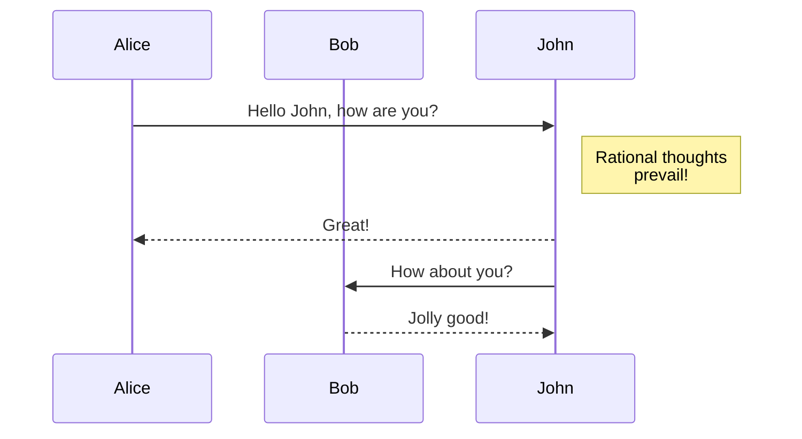

# First Section

## Making slides

Reveal.js with Pandoc is awsome

:::{.fragment .fade-right}
This block is dynamic
:::

## Custom styling

:::{style="color: blue;"}
Feeling blue
:::

# Second section

Show me a quote

:::{.fragment}
> Someone once said...
:::

# Text

## Emphasized text

_I'm emphasized_

__And I'm bold__

## Code

Expression: `let x: i32 = 3 + 4;`

Code block (Javascript):
```javascript
const x = 3 + 4;

console.log(x);
```

Code block (Rust):
```rust
fn main() {
    // Print text to the console
    println!("Hello World!");
}
```

## Mermaid diagrams


